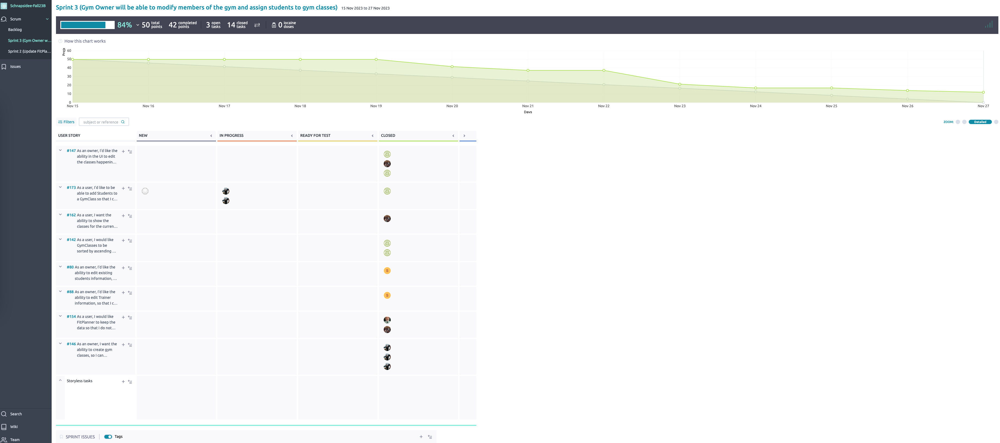

# Deliverable Information
   > Please include your answers below in a good format so it is easy for me to see. For answers to questions please use these Blockquotes. Make sure you also check the kickoff document for more details. Also make sure this thing is well formatted and the links are links in here. 

## 1: Basic Information (needed before you start with your Sprint -- Sprint Planning)

**Topic you chose:** Gym scheduling

**Sprint Number:** 3

**Scrum Master**: Rhett Harrison

**Git Master**: Sean Mckeighan

### Sprint Planning (For Sprint 1-3)
Document your Sprint Planning here. Also check the kickoff document for more details on what needs to be done. This is just the documentation. 

**Sprint Goal:** Gym Owner will be able to modify members of the gym and assign students to gym classes

**How many User Stories did you add to the Product Backlog:**  9, 3 carry-overs from last sprint

**How many User Stories did you add to this Sprint:** 8
> Answer the questions below about your Sprint Planning?

**Why did you add these US, why do you think you can get them done in the next Sprint?**

> We believe that the addition of these USs will be a good milestone for the project as a whole. Since we already have working UIs, we are mostly making updates, which should make it easier to finish all the USs.

**Why do you think these fit well with your Sprint goal? (details)**

> Once all of these User Stories are done, the gym owner will be able to modify members of the gym, including trainers and students, and will be able to assign students to gym classes, fulfilling the sprint goal.

**Do you have a rough idea what you need to do? (if the answer is no then please let me know on Slack)**

> Yes, we do!

### Schnapsidee Agreed Timeline
```
11/15-11/27 (11 day sprint + 2 days thanksgiving)
Retro on 28 (wrap up any last minute commits)
Turn in on 28 or 29 at absolute latest 
*(Sprint 3 goes to master on 29th no matter what, plan accordingly)
```

## 2: During the Sprint
> Fill out the Meeting minutes during your Sprint and keep track of things. Update your Quality policies when needed, as explained in the lectures and in the Quality Policy documents on Canvas. 
I would also advise you to already fill out the Contributions section (End of sprint) as you go, to create less work at the end.

### Meeting minutes of your Daily Scrums (3 per week, should not take longer than 10 minutes):
> Add as many rows as needed and fill out the table. (Burndown starts with Sprint 2, and Continuous Integration starts with Sprint 3, not needed before that). 

| Date  | Who did NOT attend | Meeting notes (very brief)                                                                     | Burndown Info (on track, ahead behind is enough) | GitHub Actions info (does the master pass) | Additional Info           |
|-------|--------------------|------------------------------------------------------------------------------------------------|--------------------------------------------------|--------------------------------------------|---------------------------|
| 11/16 | Nobody             | Initial updates for the sprint                                                                 | Behind                                           | Yes                                        | :)                        |
| 11/18 | Nobody             | First real standup meeting. Team is working.                                                   | Behind                                           | Yes                                        | :)                        |
| 11/20 | Nobody             | Team is at work. Getting the things done.                                                      | Less Behind                                      | Yes                                        | Focusing on Pull Requests |
| 11/22 | Nobody             | We are deep in development. Wide open.                                                         | Less Behind                                      | Yes                                        | :)                        |
| 11/25 | Frankie, Sean      | Not much was done (expected) due to Thanksgiving. Towards the end of development of the sprint | On Track                                         | Yes                                        | :)                        |
| 11/27 | Nobody             | Wrapping up sprint                                                                             | Behind                                           | Yes                                        | :)                        |


## 3: After the Sprint

### Sprint Review
Answer as a team!

**Screen Cast link**: https://youtube.com/watch?v=M7kzpFF5zZaw

> Answer the following questions as a team. 

**What do you think is the value you created this Sprint?**

> The FitPlanner product is now a completed working product with ability to schedule and edit gym classes.
> To make it easier for gym staff, there is new capability to view gym classes by each room as well
> as see a dashboard with all gym classes in each room for the current day. Additionally, there is 
> ability to edit students and trainers to avoid the need of having to remove and re-add them. All 
> entered data is automatically saved and reloaded each time the application is opened.

**Do you think you worked enough and that you did what was expected of you?**

> Yes, we aimed to get all work done in the Sprint. We ran into unforeseen issues such as dependencies
> and challenge resolving merge conflicts. Overall, we made sure that a fully working gym scheduling
> application was delivered.

**Would you say you met the customers’ expectations? Why, why not?**

> We came close to meeting the customers' expectations. We certainly delivered value but ran
> out of time for some of the features.
>>>>>>>>> Temporary merge branch 2


### Sprint Retrospective

> Include your Sprint retrospective here and answer the following questions in an evidence based manner as a team (I do not want each of your individuals opinion here but the team perspective). By evidence-based manner it means I want a Yes or No on each of these questions, and for you to provide evidence for your answer. That is, don’t just say "Yes we did work at a consistent rate because we tried hard"; say "we worked at a consistent rate because here are the following tasks we completed per team member and the rate of commits in our Git logs."

**Did you meet your sprint goal?**

> We partially met the sprint goal in that the application supports modifying members of the gym. For the backend, the GymClass has functionality to add and remove students, although we ran out of time to implement the corresponding UI.

**Did you complete all stories on your Spring Backlog?**

> We completed seven out of eight stories.

**If not, what went wrong?**

> We had stories in progress that blocked the last story due to dependencies.

**Starting in Sprint 2**
Include a screenshot of your Burndown chart here and analyse in detail for me why it looks the way it does and how you could improve it if it needs improving. 



> November 15-19: No burndown at first due to getting code reviews and challenging git merges from Sprint 2 in place
> <br>20-22: 25% burndown as we made progress eliminating dependencies
> <br>23: substantial burndown with increased velocity before Thanksgiving so that we could take a break
> <br>24-27: steady burndown but slowing down due to high point US completed and lower point US having additional overhead of code reviews

**Did you work at a consistent rate of speed, or velocity? (Meaning did you work during the whole Sprint or did you start working when the deadline approached.)**

> Yes, we worked during the whole sprint. We did not cram everything into the last few days. We had variation in how much we got done but worked consistently throughout the whole sprint.

**Did you deliver business value?**

> Yes. The key features that added value are the ability to add and edit gym classes, where a gym class contains a class name/type, date, trainer, and assigned room. Also, the ability to edit students and trainers. Additionally, there is data persistence so that all the data entry is not lost when a user opens and closes the program.

**Did you follow the Scrum process (e.g. move Tasks correctly?, keep the Taiga board up to date? work consistently?)**

> Yes, we improved compared to Sprint 2. With more experience learned, Sprint 3 was less chaotic and more organized in working together to move tasks through each stage and test each other's tasks.

**Are there things the team thinks it can do better in the next Sprint? (not needed for last Sprint)**

> n/a (this is last sprint)

**How do you feel at this point? Get a pulse on the optimism of the team.**

> Good. :smiley:

### Contributions:

> In this section I want you to point me to your main contributions (each of you individually) for the current Sprint. Some of the below you will only need starting in later Sprints, I marked when they become important. 

Copy the section for each team member and then everyone adds their individual contributions. 

#### Steven Stovall

##### Do you think you individually worked consistently and put in enough work into the project (give a short answer)?
> I had a slow start day 1-3, catching up day 4-6, and ahead of target day 7 through end of Sprint. I helped to resolve blockers for teammates during first half and delayed my US/Task contributions until midway through Sprint. At all times, I communicated and collaborated daily in Slack. I underestimated the additional time required to resolve checkstyle/spotbugs but chose to spend my time to deliver the highest quality code (test coverage, detailed unit tests, checkstyle/spotbugs) in Sprint 3 even if that meant a slower rate of delivery due to our customer wanting a combination of usable functionality and high quality. Overall, I would have liked to deliver additional features but think I delivered sufficient value and helped the team. In hindsight, I would have grouped US80 and US88 to a single US with two tasks and double the story point estimate due to complexity added of input validation in addition to editing.

> Table: Sprint Days: Hours

| Sprint Day       | 1 (W) | 2 (R) | 3 (F) | 4 (Sa) | 5 (Su) | 6 (M) | 7 (T) | 8 (W,R,F) | 9 (Sa) | 10 (Su) | 11 (M) | 12 (T) |
|------------------|-------|-------|-------|--------|--------|-------|-------|-----------|--------|---------|--------|--------|
| Cumulative Hours | 0     | 3     | 3     | 4.5    | 6.5    | 8     | 10    | 16        | 19     | 21.5    | 23     | 25     |

> Target Hours: `(11/7) * 10 hours/per week => 15.7 hours (1.4hr/day pace)`

> 11-day Sprint - Daily Concise Summary (Day) (+hours)
* 1: No Work (W) +0
* 2: PR54 resolves Zach's blocker (R) +3
* 3: No Work (F) +0
* 4: Slack detailed response: Help Sean debug Task156 (Sa) +1.5
* 5: Slack, discuss PR56, commit US88.Task110 (Su) +2
* 6: Slack, Review PR47, PR50, Task168 (M) +1.5
* 7: QualityPolicy commit improvements. commit US88.Task110. Review PR55 (T) +2
* 8.1: commit US88.Task110 unit test (W) +2.5
* 8.2: commit US88 spotbugs/checkstyle. Start US80, Slack work with Rhett to fix dev, Review PR60 (R) +3
* 8.3: Create PR61, merge latest dev into US88 (F) +0.5
* 9: Merge Sean's Task156 to US80 with necessary refactor to resolve conflicts. Share with Frankie to avoid duplicate work. Review PR58. Commit US80.Task96 (Sa) +3
* 10: US80 work (test/SA), Review Task155 (Su) +2.5
* 11: PR63, Resolve US80 issue, SA, PR64 (dev/master conflict solution) (M) +1.5
* 12: Review PR62, PR65, Video, PR63 dev conflict resolution/enhancements
* Retro: Coordinate and create video from team's video clips (T) +2

##### Below I want links that I can click on to your commit or PullRequest with your work (not the branch you worked on). I also want a short description what this commit/PR is about (or test etc.)
* See sections below

##### Links to GitHub commits (not PR) with main code contribution (up to 5 links) - important in each Sprint:
* [US88 Task110: Implement trainer edit dialog, add to checkstyle (WIP)](https://github.com/amehlhase316/Schnapsidee-Fall23B/commit/cef997510efcb5843c3742143fd6aaa18ab35e7d)
* [US88 Task110: Implement trainer edit dialog, add Trainer.editTrainer, Trainer.validateName, and show error box with useful info when invalid input, or store and refresh trainer table when valid input](https://github.com/amehlhase316/Schnapsidee-Fall23B/commit/4dbb3a226e3e20dd8e06a23e7c4da407e9a2df7e)
* [US80 Task96: Implement ability to edit students with user friendly error messages and ensure table properly reflects edited student](https://github.com/amehlhase316/Schnapsidee-Fall23B/commit/87a9f43f0bebc4ebde8675ca846e16083999a42c)
* [US80 Task96: Resolve issue with student table not refreshing after edit and add StudentDialogEdit to build.gradle for checkstyle](https://github.com/amehlhase316/Schnapsidee-Fall23B/pull/63/commits/cfb8dce0a723a24dccd8424f49617ac5f9cc80b6)

##### GitHub links to your Pull Requests (up to 3 links) -- fill out starting Sprint 1:
* [PR54: Bugfix: Enhance trainer list unit test to avoid conflict with others tests and enable spotbugs](https://github.com/amehlhase316/Schnapsidee-Fall23B/pull/54)
    * (bugfix branch inadvertently prefixed with sprint2 instead of sprint3)
* [PR61: US88 Edit trainer information with validation and friendly error messages](https://github.com/amehlhase316/Schnapsidee-Fall23B/pull/61)
* [PR63: US80 edit existing students #63](https://github.com/amehlhase316/Schnapsidee-Fall23B/pull/63)
* [PR64: Sprint3 update dev with latest master](https://github.com/amehlhase316/Schnapsidee-Fall23B/pull/64)
    * essentially merges master to dev without a push directly to dev

##### GitHub links to your Unit Tests (up to 3 links) -- fill out starting Sprint 3 (everyone should write 4 good Unit Tests each Sprint):
* [US88 Task110 Unit Test: Ensure coverage for Trainer (100%), TrainerList (94%) by adding test trainerEditTrainer (BVA), trainerValidateName, getTrainersArray, getTrainers, exceptionInstantiateUtilityTrainerList, and getRemoveTrainerByIndex](https://github.com/amehlhase316/Schnapsidee-Fall23B/commit/d7f9cb87213c34fbbbbbb668daf898da8bce1d97)
* [US88 Task110 Unit Test: Replace text blocks with normal Strings. Although working in Intellij, text blocks cause build failures with checkstyle. Remove unused imports and add TestTrainerList to checkstyle in build.gradle](https://github.com/amehlhase316/Schnapsidee-Fall23B/commit/b3965aebf11ff15746e1b76d303d39c2b2ae24d9)
* [US80 Task96 Unit Test: studentEditStudent, studentValidateName similar to TestWhiteBoxTrainer but unable to extract to separate class at this time](https://github.com/amehlhase316/Schnapsidee-Fall23B/commit/6a38697f05556e55c7e8b87e632e42bbcc19fe9a)


##### GitHub links to your Code Reviews (up to 3 links) -- fill out starting Sprint 3:
* [Review PR47](https://github.com/amehlhase316/Schnapsidee-Fall23B/pull/47#issuecomment-1818851088)
* [Review PR50](https://github.com/amehlhase316/Schnapsidee-Fall23B/pull/50#pullrequestreview-1740918915)
* [Review PR55](https://github.com/amehlhase316/Schnapsidee-Fall23B/pull/55#pullrequestreview-1743534077)
* [Review PR60](https://github.com/amehlhase316/Schnapsidee-Fall23B/pull/60#pullrequestreview-1746976347)
* [Review PR58](https://github.com/amehlhase316/Schnapsidee-Fall23B/pull/58#pullrequestreview-1749259690)
* [Review PR62](https://github.com/amehlhase316/Schnapsidee-Fall23B/pull/62#pullrequestreview-1751896408)
* [Review PR65](https://github.com/amehlhase316/Schnapsidee-Fall23B/pull/65#pullrequestreview-1753661829)

##### How did you contribute to Static Analysis -- fill out starting Sprint 4:
* [Resolve two spotbug warnings for RV return value ignored](https://github.com/amehlhase316/Schnapsidee-Fall23B/commit/90cdfebe590356838535ac2606e6bd52b9777043)
    * No US/Task due to part of bugfix branch for Sprint3. Inadvertently prefixed with sprint2 instead of sprint3.
* [US88 Task110: Resolve 12 Checkstyle errors to ensure zero errors for all FitPlanner in-scope](https://github.com/amehlhase316/Schnapsidee-Fall23B/commit/764b8b9d02899f5ae189caeb2a5e0eb0707cde8a)
* [US88 Task110: Refactor to resolve 5 Spotbugs warnings 1 MS_EXPOSE_REP via return copy ArrayList; 2 EI_EXPOSE_REP2 via implementation of public static method to avoid need to pass reference via constructor; 2 OS_OPEN_STREAM via closing object and file streams](https://github.com/amehlhase316/Schnapsidee-Fall23B/commit/d674e9df0e25ba4caf2bdcaec75a3142d666124d)
* [US80 Task96: Resolve 40 checkstyle errors](https://github.com/amehlhase316/Schnapsidee-Fall23B/commit/5b8edf7cf33c52cda009ee7605713e0556d0b738)

##### QualityPolicy.md Commits
* [Add unit test commit message format](https://github.com/amehlhase316/Schnapsidee-Fall23B/commit/42cdc38bd5156b995b65a75a09812d16f037d535)
* [Add details to Blackbox guidelines of what, who, how, and jacoco](https://github.com/amehlhase316/Schnapsidee-Fall23B/commit/0c47fca2811c91bf13f78933080bba6a791ff78d)
* [Add maintain US and Task branches suggestion to avoid merge conflicts experienced between Sprint 2 and 3](https://github.com/amehlhase316/Schnapsidee-Fall23B/commit/49c4d6b5a506878bd14ad43d507547e578899e79)
* [Add details to Blackbox guidelines of tool, what who, how, and move jacoco from Blackbox to Whitebox](https://github.com/amehlhase316/Schnapsidee-Fall23B/commit/764f4abbd27744466550dd890fed95a30b3e662a)


#### Rhett Harrison

  **Do you think you individually worked consistently and put in enough work into the project (give a short answer).

> I believe I worked consistently with the team and put enough work in the project.

 Below I want links that I can click on to your commit or PullRequest with your work (not the branch you worked on). I also want a short description what this commit/PR is about (or test etc.)

  Example: 
  [Commit 1](https://github.com/amehlhase316/memoranda/commit/b949872433ae07f723bebe13c916064d03ef8882) - Updated DeliverableX.md table to include who did not attend meetings

  **Links to GitHub commits (not PR) with main code contribution (up to 5 links) - important in each Sprint:

    
[Sort GymClasses UI](https://github.com/amehlhase316/Schnapsidee-Fall23B/commit/243ffa2b2a8fc598bf5a3c1122dfd3eb19f23054)

[Edit Gym Classes](https://github.com/amehlhase316/Schnapsidee-Fall23B/commit/136ae07785f812571fb69f102e0c772322082327)

  **GitHub links to your Pull Requests (up to 3 links) -- fill out starting Sprint 1:

[Date bug fix](https://github.com/amehlhase316/Schnapsidee-Fall23B/pull/65)

[Sort GymClasses UI](https://github.com/amehlhase316/Schnapsidee-Fall23B/pull/58)

[Add students to GymClass Initial](https://github.com/amehlhase316/Schnapsidee-Fall23B/pull/55)


   **GitHub links to your Unit Tests (up to 3 links) -- fill out starting Sprint 3 (everyone should write 4 good Unit Tests each Sprint):

  [Sort GymClasses](https://github.com/amehlhase316/Schnapsidee-Fall23B/blob/10325bdbcc0eee87f9012cdc7479c8af34626e80/src/test/java/GymClassListTest.java)

[Add Students to GymClass](https://github.com/amehlhase316/Schnapsidee-Fall23B/commit/e7755c7a429899668b4a7fc81f7d22ba82e7e11d)

  
  **GitHub links to your Code Reviews (up to 3 links) -- fill out starting Sprint 3:

  [Edit existing students](https://github.com/amehlhase316/Schnapsidee-Fall23B/pull/63/files/1155363bd5538b4c6d3ec21dcc0b6819fd7416f1)

  [Daily Overview](https://github.com/amehlhase316/Schnapsidee-Fall23B/pull/59)

#### Frank Lin

**Do you think you individually worked consistently and put in enough work into the project (give a short answer).

> Certainly! I made sure to consistently contribute to the project by fulfilling my assigned tasks, attending all relevant meetings, and actively collaborating with the team to ensure the project's success.

Example:
[Commit 1](https://github.com/amehlhase316/memoranda/commit/b949872433ae07f723bebe13c916064d03ef8882) - Updated DeliverableX.md table to include who did not attend meetings

**Links to GitHub commits (not PR) with main code contribution (up to 5 links) - important in each Sprint:

- [Integrate the create new gym class dialog into the gym class panel.](https://github.com/amehlhase316/Schnapsidee-Fall23B/commit/d5e34f99b023f2d76138157c939a6749ae6e2a16)

**GitHub links to your Pull Requests (up to 3 links) -- fill out starting Sprint 1:

- [Implements the ability that allows the end user to add a gym class and to display them on the gym class panel.](https://github.com/amehlhase316/Schnapsidee-Fall23B/pull/56)

**GitHub links to your Unit Tests (up to 3 links) -- fill out starting Sprint 3 (everyone should write 4 good Unit Tests each Sprint):

- [Add tests for gym class creation.](https://github.com/amehlhase316/Schnapsidee-Fall23B/commit/e29147012a4b1183ba63d30285e6229762460733)


**GitHub links to your Code Reviews (up to 3 links) -- fill out starting Sprint 3:

- [Code review to the PR that implements a daily view panel.](https://github.com/amehlhase316/Schnapsidee-Fall23B/pull/59)

**How did you contribute to Static Analysis -- fill out starting Sprint 4:

- [Resolve checkstyle errors in a working US branch.](https://github.com/amehlhase316/Schnapsidee-Fall23B/commit/908d98096f4a0db6eb0947a322ac6b3255e0c950)


#### Zachary Pangerl

**Do you think you individually worked consistently and put in enough work into the project (give a short answer).

Below I want links that I can click on to your commit or PullRequest with your work (not the branch you worked on). I also want a short description what this commit/PR is about (or test etc.)

Example:
[Commit 1](https://github.com/amehlhase316/memoranda/commit/b949872433ae07f723bebe13c916064d03ef8882) - Updated DeliverableX.md table to include who did not attend meetings

**Links to GitHub commits (not PR) with main code contribution (up to 5 links) - important in each Sprint:

    - link1
    - link2

**GitHub links to your Pull Requests (up to 3 links) -- fill out starting Sprint 1:

    - link1
    - link2

**GitHub links to your Unit Tests (up to 3 links) -- fill out starting Sprint 3 (everyone should write 4 good Unit Tests each Sprint):

    - link1
    - link2


**GitHub links to your Code Reviews (up to 3 links) -- fill out starting Sprint 3:

    - link1
    - link2

**How did you contribute to Static Analysis -- fill out starting Sprint 4:

    - link1
    - link2

#### Sean Mckeighan

**Do you think you individually worked consistently and put in enough work into the project (give a short answer).

Below I want links that I can click on to your commit or PullRequest with your work (not the branch you worked on). I also want a short description what this commit/PR is about (or test etc.)

Example:
[Commit 1](https://github.com/amehlhase316/memoranda/commit/b949872433ae07f723bebe13c916064d03ef8882) - Updated DeliverableX.md table to include who did not attend meetings

**Links to GitHub commits (not PR) with main code contribution (up to 5 links) - important in each Sprint:

    - link1
    - link2

**GitHub links to your Pull Requests (up to 3 links) -- fill out starting Sprint 1:

    - link1
    - link2

**GitHub links to your Unit Tests (up to 3 links) -- fill out starting Sprint 3 (everyone should write 4 good Unit Tests each Sprint):

    - link1
    - link2


**GitHub links to your Code Reviews (up to 3 links) -- fill out starting Sprint 3:

    - link1
    - link2

**How did you contribute to Static Analysis -- fill out starting Sprint 4:

    - link1
    - link2

## Below is just for you as a little reminder on what needs to be done
### Checklist for you to see if you are done with the current Sprint
- [x] Form above is complete
- [x] Your newest software is on the master branch on GitHub, it is tested and compiles/runs
- [ ] This document is in your master branch on GitHub
  - Will be delivered Wednesday afternoon (11/29)
- [x] Read the kickoff again to make sure you have all the details that I want
- [x] User Stories that were not completed, were left in the Sprint and a copy created to move to the next Sprint
  - n/a last sprint
- [x] Your Quality Policies are accurate and up to date
- [ ] **Individual** Survey was submitted **individually** (create checkboxes below -- see Canvas to get link)
  - [x] Rhett Harrison
  - [ ] Frank Lin
  - [ ] Steven Stovall
  - [ ] Zachary Pangerl
  - [ ] Sean Mckeighan

#### For the next Sprint (n/a - last sprint)
  - [ ] The original of this file was copied for the next Sprint (needed for all but last Sprint where you do not need to copy it anymore)
    - [ ] Basic information (part 1) for next Sprint was included in this new Deliverable document 
  - [ ] You added new User Stories to your Product Backlog, they are correctly written (needed after Sprint 1, 2)
  - [ ] All User Stories have acceptance tests
  - [ ] User Stories in your new Sprint Backlog have initial tasks which are in New column
  - [ ] You know how to proceed (if not please reach out)
